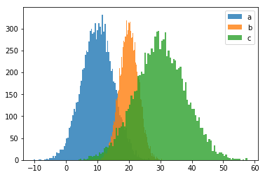

# python-distribution
Distribution package for python

## sample 
```python
from matplotlib import pylab as plt
from python_dist import NormalDist

a = NormalDist(10, 5)
b = NormalDist(20, 3)
c = a + b

plt.hist(a.get_samples(10000), bins=100, alpha=0.8, label="a")
plt.hist(b.get_samples(10000), bins=100, alpha=0.8, label="b")
plt.hist(c.get_samples(10000), bins=100, alpha=0.8, label="c")
plt.legend()

plt.show()
```

Then we get



```python
> print(c)
NormalDist (mu = 30, sigma^2 = 8)
```